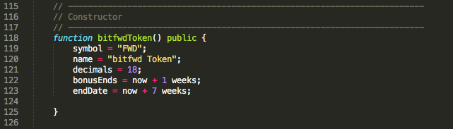
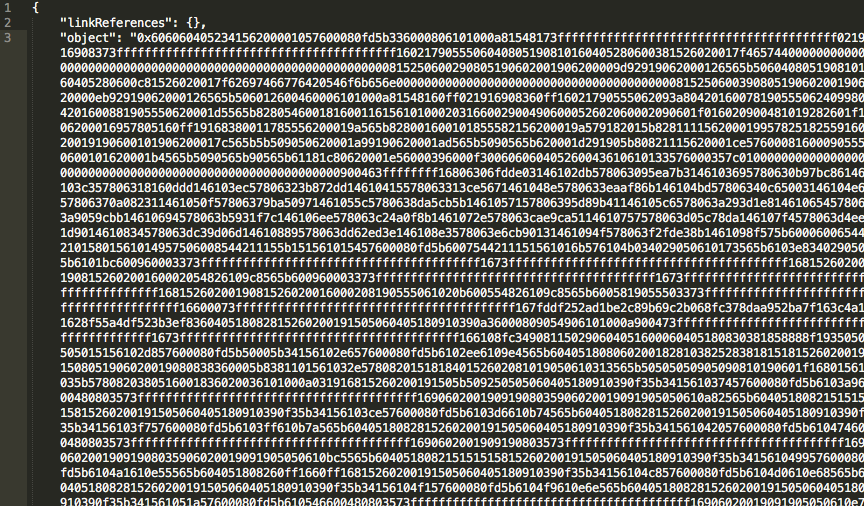

### ICO-tutorial

## The following are required in order to create your first ICO on the Ethereum blockchain!
- 📃 Ethereum Address (Ropsten Network) [ We will be using the Ropsten Network to test out our ICO before laucnhing onto the mainnet! ]
- 🪙 Some Ethereum (Ropsten Network) [ We will be using MyEtherWallet but any wallet works. ]
- 📜 Text Editor (I.e Sublime/Atom) [ We will be using [Sublime][3]. ]
- 📝 Solidity Contract [We will be using this [Sol Contract][4]. Credit to [BokkyPooBah][5]. ]
- 🤞 A bunch of lucky charms during this process. 

Before we start credit to [Moritz Neto][1]!

## To Start
- Open the contract you downloaded in your Text Editor.
- Go to Line 3–15 and look at the comment section. Although this is a comment section, this will help you down the track. The name of the template ICO is ‘bitfwd’ CROWDSALE token contract
- Change Line 4 to the title of your crowdsale.
- You will just change Line 6 after you deploy the contract on the Blockchain.
- Change Line 7’s Symbol to your respective coin name (Keep it short)
- Change Line 8 to the name of your token

## Next
- Go to Line 102 and change “bitfwd” to “(YourCrowdsaleName). DON’T USE SPACE OR IT WON’T WORK.
- Do the same for Line 118
- Go to Line 119 and change the symbol name, the same as the ones you did in the comment section
- Do the same for Line 120
- Leave Decimals at 18.
- On line 122 you will have to define you first ICO parameter, when does the bonus ends?
- And on line 123, you will define when does the Crowdsale ends.

## Next
- Now, go to line 212. On that comment, write what is the amount of your tokens you will be giving away for ETH.
- On line 218, define how much people will get within the BONUS.
- On line 220, define how much people will get without the BONUS (the same ratio that you put on line 212).

## Head Over To [Remix][2]
- Go to http://remix.ethereum.org/
- In the browser/ballot.sol, paste the code you just edited! If something red comes up, there is something wrong in the code. If there are any yellow warnings it’s alright, let’s hope for the best.

## Head over to compile
- Now Under Compile→Choose the Token you are creating →Details
- On ByteCode press the 📋button to copy the ByteCode to your clipboard.
- Now, you will paste it into code editor. DON’T FREAK OUT. There will be a lot of stuff there. The one and only thing we want is the BYTECODE (a huge chunk of numbers and letters) from the object. What you will see will be like: “object”: “BYTECODE”, .
- Add 0x to the beginning of the BYTECODE, like: “object”: “0xBYTECODE”,. And copy it to another file on the text editor.

- Now, go to MEW where we will start to deploy the contract. REMEMBER we want to be on the Ropsten Test Network so make sure the top right hand corner says that.
- Navigate to the Contracts tab → Press Deploy Contract
- Paste your ByteCode into the ByteCode box. Your gas limit should automatically update
- Access your wallet by going into the Private Key → Enter your private key →Unlock your wallet
- Now press Sign Transaction → Deploy Contract

## Transaction Hash

- Click on the transaction tx or access https://ropsten.etherscan.io to check if the contract went through. If it didn’t, start again and try to figure it out what you got wrong. If it worked, you did it!

[1]: https://medium.com/bitfwd/how-to-do-an-ico-on-ethereum-in-less-than-20-minutes-a0062219374 "Moritz Neto"
[2]: https://remix.ethereum.org/#optimize=false&runs=200&evmVersion=null&version=soljson-v0.6.2+commit.bacdbe57.js "Remix"
[3]: https://www.sublimetext.com/ "Sublime"
[4]: https://github.com/alfonsolua36/ICO-tutorial/blob/master/ico-contract.sol "Sol Contract"
[5]: https://medium.com/@BokkyPooBah "BokkyPooBah"